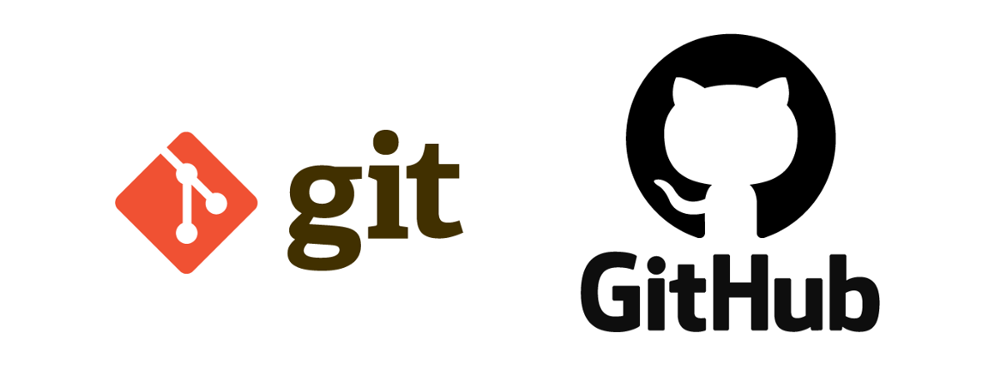

   
# ***Git / GitHub***
---
---
   

    
---
---
   
## **Índice:**

- ¿Qué es Git?

- ¿Para qué proyectos sirve Git?

- Características de Git

- ¿Qué es Github?

- Características de Github

- Glosario de términos

---
---
     

### **¿Qué es Git?**
---
Git es una herramienta que realiza una función del control de versiones de código de forma distribuida. 
Git está optimizado para guardar cambios de forma incremental. 
Permite contar con un historial, regresar a una versión anterior y agregar funcionalidades. 
Lleva un registro de los cambios que otras personas realicen en los archivos.

Git fue diseñado para operar en un entorno Linux. Actualmente, es multiplataforma, es decir, es compatible con Linux, MacOS y Windows.

---
### **¿Para qué proyectos sirve Git?**
---
Con Git se obtiene una mayor eficiencia usando archivos de texto plano, ya que con archivos binarios no puede guardar solo los cambios, sino que debe volver a grabar el archivo completo ante cada modificación, por mínima que sea, lo que hace que incremente demasiado el tamaño del repositorio.

“Guardar archivos binarios en el repositorio de Git no es una buena práctica, únicamente deberían guardarse archivos pequeños (como logos) que no sufran casi modificaciones durante la vida del proyecto. Los binarios deben guardarse en un CDN”.

---
### **Características de Git**
---
- Es muy potente.

- Fue diseñada por Linus Torvalds.
- No depende de un repositorio central.
- Es software libre.
- Con ella podemos mantener un historial completo de versiones.
- Podemos movernos, como si tuviéramos un puntero en el tiempo, por todas las revisiones de código y desplazarnos una manera muy ágil.
- Es muy rápida.
- Git almacena la información como un conjunto de archivos.
- No existen cambios, corrupción en archivos o cualquier alteración sin que Git lo sepa.
- En cuanto a la funcionalidad de las ramas, las mismas están destinadas a provocar proyectos divergentes de un proyecto principal, para hacer experimentos o para probar nuevas funcionalidades.
- Las ramas pueden tener una línea de progreso diferente de la rama principal donde está el core de nuestro desarrollo. En algún momento podemos llegar a probar algunas de esas mejoras o cambios en el código y hacer una fusión a nuestro proyecto principal, ya que todo esto lo maneja Git de una forma muy eficiente.

---
### **¿Qué es Github?**
---
Github es una plataforma de desarrollo colaborativo para alojar proyectos utilizando el sistema de control de versiones Git. Se emplea principalmente para la creación de código fuente de programas de computadora.

Puede considerarse a Github como la red social de código para los programadores y en muchos casos es visto como un curriculum vitae, pues aquí se guarda el portafolio de proyectos de programación.

---
### **Características de Github**
---
- Puedes compartir fácilmente tus proyectos.

- Permite colaborar para mejorar los proyectos de otros y a otros mejorar o aportar a los tuyos.

- GitHub permite alojar proyectos en repositorios de forma gratuita y pública, pero tiene una forma de pago para privados.

- Ayuda a reducir significativamente los errores humanos, a tener un mejor mantenimiento de distintos entornos y a detectar fallos de una forma más rápida y eficiente.

- Es la opción perfecta para poder trabajar en equipo en un mismo proyecto.

- Ofrece todas las ventajas del sistema de control de versiones Git, pero también tiene otras herramientas que ayudan a tener un mejor control de los proyectos.

---
### **Glosario de términos**
---
> #### **Repository:**
 Un repositorio es el elemento más básico de GitHub. Es más fácil imaginarlos como carpetas de proyecto. Un repositorio contiene todos los archivos de un proyecto (incluyendo la documentación), y almacena el histórico de modificaciones de cada archivo. Los repositorios pueden tener múltiples colaboradores y pueden ser tanto públicos como privados.

> #### **Commit:** 
Un commit se puede entender como la confirmación de una modificación individual en un archivo (o serie de archivos). Es como cuando guardas un archivo, excepto que con Git, cada vez que haces commit se crea un ID único (también conocido como SHA o hash) que te permite registrar qué cambios se hicieron y quién los hizo. Los commits generalmente contienen un mensaje de commit que consiste en una breve descripción de los cambios realizados.

> #### **Push:**
Literalmente, empujar. Se refiere a enviar tus cambios confirmados (tus commits) a un repositorio remoto, como por ejemplo un repositorio alojado en GitHub. Si cambias algo localmente, querrás hacer push de esos cambios para que los demás miembros de tu equipo puedan acceder a ellos.

> #### **Pull:** 
Literalmente, tirar. Se refiere a traer los cambios del servidor remoto y combinarlos con tu copia local. Por ejemplo, si alguien ha editado el archivo remoto en el que ambos estáis trabajando, querrás hacer pull de esos cambios a tu copia local para que esté actualizada.

> #### **Issue:** 
Los issues son sugerencias de mejora, tareas o cuestiones relacionadas con el repositorio o el proyecto. Cualquiera puede crear issues (en un repositorio público), y los moderan los colaboradores del repositorio. Cada issue contiene su propio foro de dissusión, y se puede etiquetar y asignar a un usuario.

> #### **Pull request:**
 Los pull requests o, literalmente, solicitudes de tirar, son cambios propuestos para un repositorio que un usuario ha enviado, y que pueden ser aceptados o rechazados por los colaboradores del repositorio. Igual que los issues, los pull requests tienen cada uno su propio foro de discusión.

> #### **Branch:** 
Un branch o, literalmente, rama, es una versión paralela de un repositorio. Está contenido dentro del repositorio, pero no afecta al branch principal o master, permitiéndote trabajar libremente sin estropear la versión “real”. Cuando has terminado de realizar los cambios que querías hacer, puedes hacer merge de tu branch al branch principal para publicar tus cambios.

> #### **Merge:**
 Literalmente, combinar. Hacer merge toma los cambios de un branch (en el mismo repositorio o también desde un fork), y los aplica en otro. Esto a menudo ocurre como un pull request (que se puede entender como una solicitud de hacer merge), o a través de la línea de comandos. Un merge puede realizarse automáticamente a través de un pull request en la interfaz web de GitHub siempre y cuando no haya cambios que generen conflictos, o puede hacerse siempre via línea de comandos.

> #### **Remote:** 
La versión remota es una versión de algo que está alojada en un servidor, muy probablemente GitHub en este contexto. Puede estar conectado a clones locales de forma que los cambios se sincronicen.

> #### **Local:** 
La versión local es la copia que tienes del repositorio en tu ordenador, sobre la que trabajas.

> #### **Clone:** 
Un clon es la copia de un repositorio que se aloja en tu ordenador, en lugar de en un servidor en alguna parte, o el acto de realizar esa copia. En tu clone puedes editar los archivos en tu editor preferido y utilizar Git para llevar un registro de esas modificaciones sin necesidad de tener conexión a internet. Sin embargo, este clon está conectado a la versión remota de forma que los cambios se puedan sincronizar entre ambos. Puedes hacer push de tus cambios locales a la versión remota para mantenerlas sincronizadas cuando estés online.

> #### **Fork:**
 Un fork o, literalmente, tenedor, es una copia personal de un repositorio de otro usuario que se aloja en tu cuenta. Los forks te permiten modificar libremente cualquier proyecto sin alterar el original. Los forks se mantienen relacionados con el original, de manera que puedes enviar un pull request al autor del repositorio original para que lo actualice con tus cambios. También puedes mantener tu fork actualizado haciendo pull de las modificaciones del original.

---